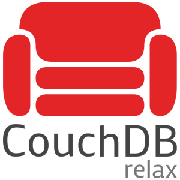

# pharo-couchdb
This provides a basic Pharo client for [CouchDB NoSQL Document Database](https://couchdb.org) with support for basic JSON documents as well objects serialization/deserialization in JSON format.

The source is based on an [old version](https://cwiki.apache.org/confluence/display/COUCHDB/Smalltalk) for VisualWorks, but this one uses [Zinc](https://github.com/svenvc/Zinc) HTTP client (`ZnClient`), URL objects (`ZnUrl`) instead of plain URL strings, has the `Couch` prefix for the class names (due to the lack of namespaces), and has other refactorings that I considered relevant (although there are many more to do).

This version also supports document attachment operations using Base64 encoding for download.



# Client Installation
```smalltalk
Metacello new
	baseline: 'CouchDB';
	repository: 'github://eMaringolo/pharo-couchdb/src';
	load.
```

# Server Installation
Download CouchDB and install it [following the instructions in CouchDB website](https://couchdb.apache.org/#download). 

If you install it using defaults, it will a create a default server running at `http://127.0.0.1:5984/` without authentication. All the exapmles will assume the server is running at that address and port.


# How to use

The current version provides the class `CouchInterface` that will provide control over the server databases.

You can instantiate an interface by evaluating:

```smalltalk
client := CouchInterface url: 'http://127.0.0.1:5984/'.
```

But that above will not attempt any connection to the server. So you can assert whether the server exists you can evaluate:
```smalltalk
client exists
```

Then you can create a database by asking the interface to create a new database.
```smalltalk
database := client create: 'pharodb`
```

If the database was already created you can also instantiate it by evaluating:
```smalltalk
database := CouchDatabase url: 'http://localhost:5984/pharodb'
```

And then, you're ready to store your first document. You can store anything that can be serialized as JSON. 

By default this CouchDB client sends the `#couchJson` message to objects to convert them to a String with JSON syntax that will be stored as the document.

```smalltalk
document := database create: { 'foo' -> true. 'baz' -> (1 to: 5) } asDictionary 
```

This will return a `CouchDocument` that will contain a dynamically assigned `_id` and other information such as the `_rev` number.

A `CouchDocument` works a wrapper for an object, which by default, as in our above example, is a `Dictionary`.

So in our above sample document, we can do:

```
document object at: 'foo' put: false.
document save
```

This will save the created document and also increment the revision number, which you can query by sending `#revision` to the document.


